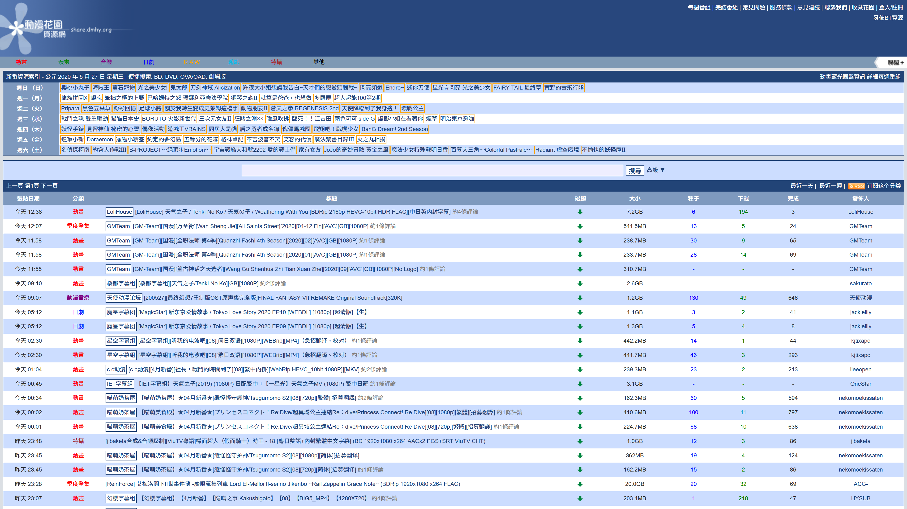
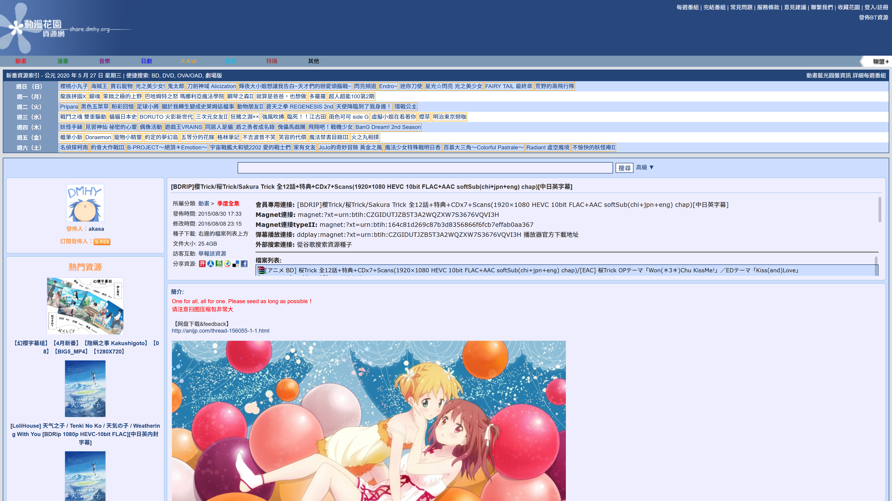

# [動漫花園](https://share.dmhy.org/)樣式調整

## 安裝

1. 安裝瀏覽器擴充套件[Stylus](https://add0n.com/stylus.html)
   - [Firefox](https://addons.mozilla.org/firefox/addon/styl-us/)
   - [Google Chrome / Microsoft Edge](https://chrome.google.com/webstore/detail/stylus/clngdbkpkpeebahjckkjfobafhncgmne)
   - [Opera](https://addons.opera.com/extensions/details/stylus/)
2. [點此](https://github.com/abc1236762/DMHY-Style-Adjustment/raw/master/DMHY-Style-Adjustment.user.css)安裝樣式

# [DMHY](https://share.dmhy.org/) Style Adjustment

## Install

1. Install browser extension [Stylus](https://add0n.com/stylus.html)
   - [Firefox](https://addons.mozilla.org/firefox/addon/styl-us/)
   - [Google Chrome / Microsoft Edge](https://chrome.google.com/webstore/detail/stylus/clngdbkpkpeebahjckkjfobafhncgmne)
   - [Opera](https://addons.opera.com/extensions/details/stylus/)
2. Click [here](https://github.com/abc1236762/DMHY-Style-Adjustment/raw/master/DMHY-Style-Adjustment.user.css) to install the style

